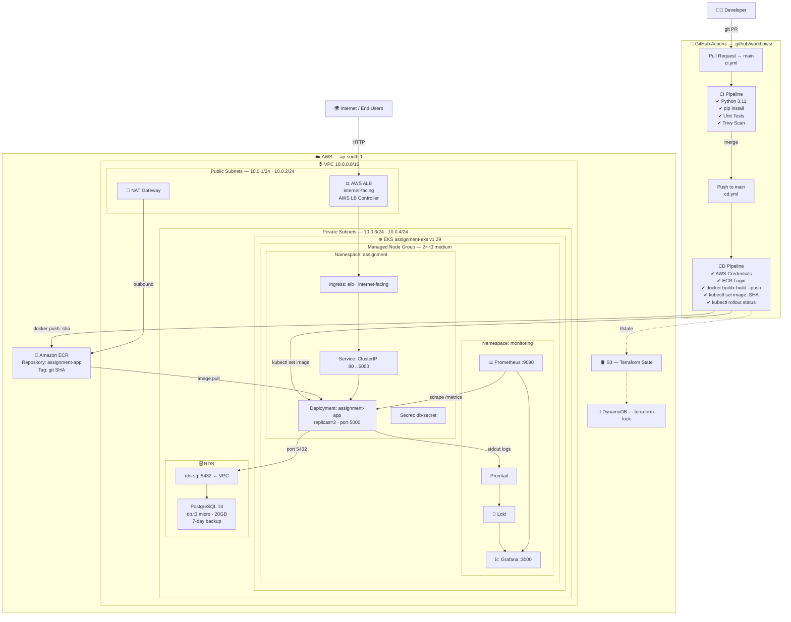
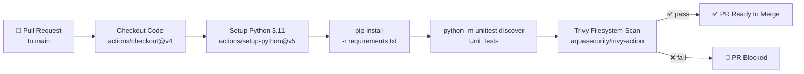
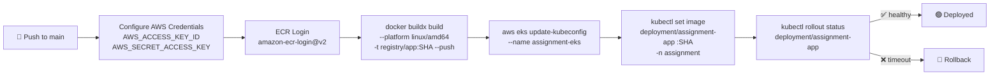
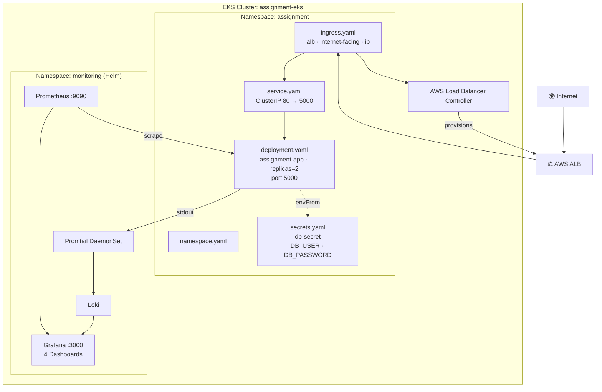
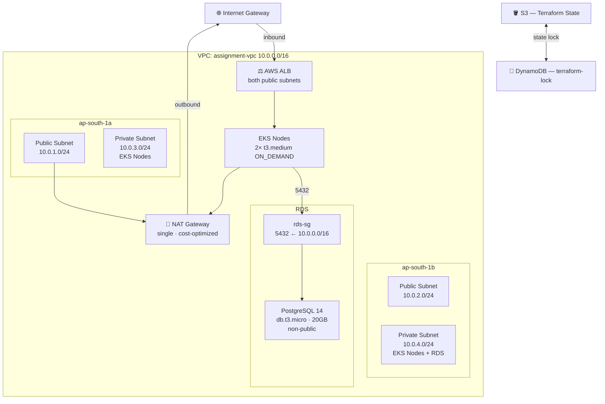
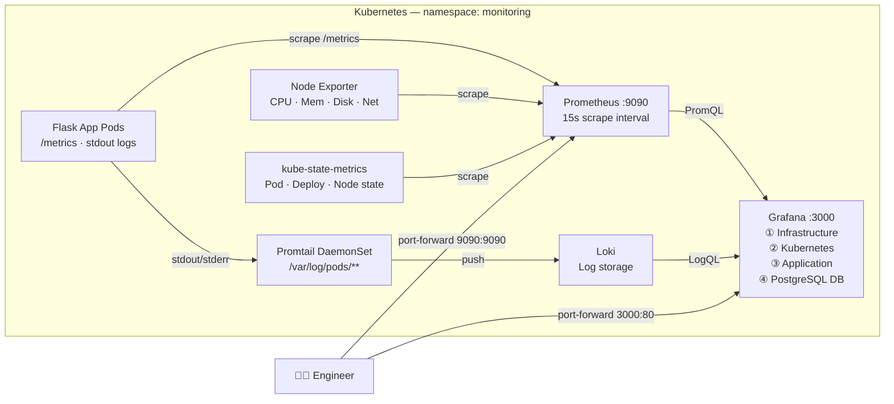

# 🚀 8byte DevOps Assignment

> **End-to-end DevOps pipeline** — Flask app containerised with Docker, deployed to AWS EKS via Terraform-provisioned infrastructure, with automated CI/CD through GitHub Actions, and full observability using Prometheus, Grafana, and Loki.


---

## 📑 Table of Contents

- [Overview](#-overview)
- [Tech Stack](#-tech-stack)
- [Project Structure](#-project-structure)
- [Architecture](#-architecture)
  - [End-to-End System](#1-end-to-end-system-architecture)
  - [CI Pipeline](#2-ci-pipeline)
  - [CD Pipeline](#3-cd-pipeline)
  - [Kubernetes Layout](#4-kubernetes-namespace-layout)
  - [AWS Network](#5-aws-network--infrastructure)
  - [Monitoring Stack](#6-monitoring--logging-stack)
- [Prerequisites](#-prerequisites)
- [Infrastructure Setup (Terraform)](#-infrastructure-setup-terraform)
- [Application Deployment](#-application-deployment)
- [Monitoring & Observability](#-monitoring--observability)
- [CI/CD Pipeline](#-cicd-pipeline)
- [Environment Variables & Secrets](#-environment-variables--secrets)
- [File Reference](#-file-reference)
- [Challenges & Lessons Learned](#-challenges--lessons-learned)

---

## 🌐 Overview

This project demonstrates a production-grade DevOps workflow:

| Stage | What happens |
|---|---|
| **Code** | Flask Python app with `/` and `/health` endpoints |
| **Build** | Docker image built with `buildx` for `linux/amd64` |
| **Test** | Unit tests + Trivy security scan on every PR |
| **Push** | Image pushed to Amazon ECR (tagged with git SHA) |
| **Infra** | AWS VPC + EKS + RDS provisioned with Terraform |
| **Deploy** | Rolling update to EKS via `kubectl set image` |
| **Observe** | Prometheus metrics + Loki logs visualised in Grafana |

---

## 🛠 Tech Stack

| Category | Technology |
|---|---|
| **Application** | Python 3.11, Flask |
| **Containerisation** | Docker (python:3.11-slim) |
| **Registry** | Amazon ECR |
| **Orchestration** | AWS EKS (Kubernetes 1.29) |
| **Infrastructure as Code** | Terraform ≥ 1.5, AWS Provider ~> 5.0 |
| **CI/CD** | GitHub Actions |
| **Security Scanning** | Trivy (aquasecurity/trivy-action) |
| **Ingress** | AWS Application Load Balancer (via ALB Ingress Controller) |
| **Database** | AWS RDS PostgreSQL 14 |
| **Metrics** | Prometheus (kube-prometheus-stack) |
| **Dashboards** | Grafana |
| **Logging** | Loki + Promtail |
| **State Backend** | S3 + DynamoDB (Terraform remote state) |

---

## 📁 Project Structure

```
8byte-devops-assignment/
│
├── README.md                          # This file
├── iam_policy.json                    # IAM policy for AWS Load Balancer Controller
│
├── .github/
│   └── workflows/
│       ├── ci.yml                     # CI — runs on every PR to main
│       └── cd.yml                     # CD — runs on every push/merge to main
│
├── app/
│   ├── app.py                         # Flask app (GET / and GET /health)
│   ├── Dockerfile                     # Container image definition
│   └── requirements.txt               # Python dependencies
│
├── k8s/
│   ├── namespace.yaml                 # Creates 'assignment' namespace
│   ├── secrets.yaml                   # DB credentials (Opaque Secret)
│   ├── deployment.yaml                # Flask app Deployment (replicas: 2)
│   ├── service.yaml                   # ClusterIP Service (port 80 → 5000)
│   └── ingress.yaml                   # ALB Ingress (internet-facing)
│
├── terraform/
│   ├── provider.tf                    # AWS provider config (ap-south-1)
│   ├── backend.tf                     # S3 remote state + DynamoDB lock
│   ├── variables.tf                   # Input variable declarations
│   ├── terraform.tfvars               # Variable values (⚠️ do not commit secrets)
│   ├── vpc.tf                         # VPC, subnets, NAT Gateway
│   ├── eks.tf                         # EKS cluster + managed node group
│   ├── rds.tf                         # RDS PostgreSQL instance
│   ├── security.tf                    # Security groups (rds-sg)
│   ├── alb.tf                         # Placeholder (ALB via K8s controller)
│   ├── outputs.tf                     # VPC ID, EKS endpoint, RDS endpoint
│   └── main.tf                        # Root module entrypoint
│
├── monitoring/
│   ├── monitoring-commands.md         # Useful kubectl monitoring commands
│   ├── prometheus/
│   │   └── metrics.md                 # Documented Prometheus metrics
│   └── grafana/
│       └── dashboards.md              # Documented Grafana dashboard specs
│
└── logging/
    └── loki/                          # Loki config dir (deployed via Helm)
```

---

## 🏗 Architecture

### 1. End-to-End System Architecture



---

### 2. CI Pipeline

> **Trigger:** Every Pull Request targeting `main`



---

### 3. CD Pipeline

> **Trigger:** Every push / merge to `main`



---

### 4. Kubernetes Namespace Layout



---

### 5. AWS Network & Infrastructure



---

### 6. Monitoring & Logging Stack



---

## 📋 Prerequisites

Make sure the following tools are installed before getting started:

| Tool | Version | Purpose |
|---|---|---|
| `terraform` | ≥ 1.5 | Infrastructure provisioning |
| `aws` CLI | ≥ 2.x | AWS authentication & EKS access |
| `kubectl` | ≥ 1.29 | Kubernetes cluster management |
| `helm` | ≥ 3.x | Prometheus/Grafana/Loki deployment |
| `docker` | ≥ 24.x | Container build (local) |

AWS credentials must have permissions for: `EC2`, `EKS`, `RDS`, `ECR`, `S3`, `DynamoDB`, `IAM`, `ELB`.

---

## ⚙️ Infrastructure Setup (Terraform)

```bash
# 1. Navigate to the Terraform directory
cd terraform

# 2. Initialise — downloads providers and configures S3 backend
terraform init

# 3. Preview what will be created
terraform plan

# 4. Apply — provisions VPC, EKS, RDS (~15-20 min)
terraform apply

# 5. Configure kubectl to talk to your new EKS cluster
aws eks update-kubeconfig --name assignment-eks --region ap-south-1
```

**Terraform outputs after apply:**

| Output | Description |
|---|---|
| `vpc_id` | ID of the provisioned VPC |
| `eks_cluster_name` | Name of the EKS cluster |
| `eks_cluster_endpoint` | API server endpoint URL |
| `rds_endpoint` | PostgreSQL connection endpoint |

---

## 🚢 Application Deployment

### Deploy Kubernetes Manifests

```bash
# Apply in order (namespace first, then secrets, then workloads)
kubectl apply -f k8s/namespace.yaml
kubectl apply -f k8s/secrets.yaml
kubectl apply -f k8s/deployment.yaml
kubectl apply -f k8s/service.yaml
kubectl apply -f k8s/ingress.yaml
```

### Verify Deployment

```bash
# Check pods are running
kubectl get pods -n assignment

# Check service
kubectl get svc -n assignment

# Check ingress (ALB URL will appear here)
kubectl get ingress -n assignment

# Watch rollout
kubectl rollout status deployment/assignment-app -n assignment
```

### Build & Push Docker Image Manually

```bash
# Login to ECR
aws ecr get-login-password --region ap-south-1 | \
  docker login --username AWS --password-stdin \
  <account-id>.dkr.ecr.ap-south-1.amazonaws.com

# Build and push
docker buildx build \
  --platform linux/amd64 \
  -t <account-id>.dkr.ecr.ap-south-1.amazonaws.com/assignment-app:latest \
  ./app --push
```

---

## 📊 Monitoring & Observability

### Install the Monitoring Stack (Helm)

```bash
# Add Helm repositories
helm repo add prometheus-community https://prometheus-community.github.io/helm-charts
helm repo add grafana https://grafana.github.io/helm-charts
helm repo update

# Install kube-prometheus-stack (Prometheus + Grafana + Alertmanager)
helm install monitoring prometheus-community/kube-prometheus-stack \
  --namespace monitoring --create-namespace

# Install Loki + Promtail
helm install loki grafana/loki-stack \
  --namespace monitoring
```

### Access Dashboards Locally

```bash
# Grafana — http://localhost:3000
kubectl port-forward svc/monitoring-grafana 3000:80 -n monitoring

# Prometheus — http://localhost:9090
kubectl port-forward svc/monitoring-kube-prometheus-prometheus 9090:9090 -n monitoring
```

> **Grafana default credentials:** `admin` / `prom-operator`

### Available Grafana Dashboards

| Dashboard | Purpose | Key Metrics |
|---|---|---|
| **Infrastructure** | Node health | CPU, Memory, Disk, Network |
| **Kubernetes** | Workload health | Pod status, Deployment replicas, Container restarts |
| **Application** | App performance | Request rate, Error rate, Response latency, Uptime |
| **PostgreSQL DB** | Database health | Active connections, Storage usage, Query activity |

---

## 🔄 CI/CD Pipeline

### CI — Runs on every Pull Request to `main`

| Step | Action |
|---|---|
| Checkout | `actions/checkout@v4` |
| Python Setup | `actions/setup-python@v5` (3.11) |
| Install Deps | `pip install -r app/requirements.txt` |
| Unit Tests | `python -m unittest discover` |
| Security Scan | `aquasecurity/trivy-action` (filesystem scan) |

### CD — Runs on every push to `main`

| Step | Action |
|---|---|
| AWS Auth | `aws-actions/configure-aws-credentials@v4` |
| ECR Login | `aws-actions/amazon-ecr-login@v2` |
| Docker Build | `docker buildx build --platform linux/amd64 --push` |
| Update kubeconfig | `aws eks update-kubeconfig` |
| Deploy | `kubectl set image deployment/assignment-app :<git-sha>` |
| Verify | `kubectl rollout status deployment/assignment-app` |

### Required GitHub Secrets

| Secret | Description |
|---|---|
| `AWS_ACCESS_KEY_ID` | AWS IAM access key |
| `AWS_SECRET_ACCESS_KEY` | AWS IAM secret key |

---

## 🔐 Environment Variables & Secrets

| Variable | Where | Value |
|---|---|---|
| `db_password` | `terraform.tfvars` | RDS PostgreSQL password |
| `DB_USER` | `k8s/secrets.yaml` | App database username |
| `DB_PASSWORD` | `k8s/secrets.yaml` | App database password |
| `AWS_ACCESS_KEY_ID` | GitHub Secrets | AWS credentials for CI/CD |
| `AWS_SECRET_ACCESS_KEY` | GitHub Secrets | AWS credentials for CI/CD |

> ⚠️ **Production note:** `terraform.tfvars` and `k8s/secrets.yaml` should not contain plaintext credentials in production. Use AWS Secrets Manager, Sealed Secrets, or External Secrets Operator.

---

## 📂 File Reference

| File | Layer | Description |
|---|---|---|
| `app/app.py` | App | Flask app — `GET /` and `GET /health`, port 5000 |
| `app/Dockerfile` | Container | python:3.11-slim, installs deps, exposes 5000 |
| `app/requirements.txt` | Container | Python dependencies (Flask) |
| `.github/workflows/ci.yml` | CI/CD | PR pipeline: tests + Trivy scan |
| `.github/workflows/cd.yml` | CI/CD | Push pipeline: build → ECR → EKS deploy |
| `k8s/namespace.yaml` | Kubernetes | Creates `assignment` namespace |
| `k8s/secrets.yaml` | Kubernetes | Opaque Secret: `DB_USER`, `DB_PASSWORD` |
| `k8s/deployment.yaml` | Kubernetes | 2-replica Flask deployment, resource limits |
| `k8s/service.yaml` | Kubernetes | ClusterIP service, port 80 → 5000 |
| `k8s/ingress.yaml` | Kubernetes | ALB Ingress (internet-facing, target-type: ip) |
| `terraform/provider.tf` | Terraform | AWS provider ~>5.0, region ap-south-1 |
| `terraform/backend.tf` | Terraform | S3 remote state + DynamoDB lock |
| `terraform/variables.tf` | Terraform | Input variable declarations |
| `terraform/vpc.tf` | Terraform | VPC 10.0.0.0/16, 2 AZs, public/private subnets, NAT |
| `terraform/eks.tf` | Terraform | EKS v1.29, 1–2× t3.medium managed node group |
| `terraform/rds.tf` | Terraform | PostgreSQL 14, db.t3.micro, private, 7-day backup |
| `terraform/security.tf` | Terraform | RDS security group (port 5432 from VPC CIDR) |
| `terraform/outputs.tf` | Terraform | vpc_id, eks name, eks endpoint, rds endpoint |
| `iam_policy.json` | IAM | IAM policy for AWS Load Balancer Controller (IRSA) |
| `monitoring/prometheus/metrics.md` | Docs | All Prometheus metrics collected |
| `monitoring/grafana/dashboards.md` | Docs | Grafana dashboard specs (4 dashboards) |

---

## 🧹 Teardown

```bash
# Remove Kubernetes workloads
kubectl delete -f k8s/

# Uninstall monitoring stack
helm uninstall monitoring -n monitoring
helm uninstall loki -n monitoring

# Destroy all AWS infrastructure
cd terraform && terraform destroy
```

---

## 🧩 Challenges & Lessons Learned

Every real-world deployment surfaces unexpected issues. Below are the key blockers encountered during this assignment, their root causes, and exactly how they were resolved.

### 🗄️ Infrastructure (Terraform)

| # | Challenge | Root Cause | Resolution |
|---|---|---|---|
| 1 | **Terraform backend `init` failed** | S3 bucket `subhanshu-terraform-state-bucket` did not exist before running `terraform init` | Manually created the S3 bucket and DynamoDB lock table in AWS Console first, then re-ran `terraform init` |
| 2 | **RDS PostgreSQL engine version mismatch** | The specified PostgreSQL engine version was not available in `ap-south-1` | Checked available versions with `aws rds describe-db-engine-versions` and updated `rds.tf` to use version `14` |
| 3 | **EKS node group creation failed** | Specified AMI type was not compatible with the EKS Kubernetes version requested | Updated `eks.tf` to use `AL2023_x86_64_STANDARD` AMI and aligned Kubernetes version to `1.29` |

---

### ☸️ Kubernetes & Networking

| # | Challenge | Root Cause | Resolution |
|---|---|---|---|
| 4 | **EKS API endpoint timeout** | EKS cluster only had private endpoint access enabled; local machine could not reach the API server | Enabled `cluster_endpoint_public_access = true` in `eks.tf` to allow kubeconfig access from local machine |
| 5 | **`ImagePullBackOff` on EKS pods** | ECR repository URI or image tag was incorrectly configured in `deployment.yaml` | Verified the full ECR URI, confirmed image was pushed successfully, and corrected the image reference in the deployment manifest |
| 6 | **ALB Ingress not provisioning** | AWS Load Balancer Controller was not installed, and public subnets were missing the required `kubernetes.io/role/elb` tag | Installed AWS LB Controller via Helm using the IRSA role backed by `iam_policy.json`; added correct subnet tags |

---

### 🐳 Docker & Build

| # | Challenge | Root Cause | Resolution |
|---|---|---|---|
| 7 | **Docker image crashed on EKS (ARM64 / AMD64 mismatch)** | Image was built locally on an Apple Silicon (ARM64) Mac, but EKS nodes run `x86_64` (AMD64) | Switched to `docker buildx build --platform linux/amd64` in the CD pipeline to force correct architecture |

---

### 📊 Monitoring

| # | Challenge | Root Cause | Resolution |
|---|---|---|---|
| 8 | **Grafana deployment inconsistency after secret deletion** | Deleting the Grafana admin secret caused the Helm-managed deployment to enter an inconsistent state | Fully uninstalled the `monitoring` Helm release and reinstalled `kube-prometheus-stack` cleanly |

---

### 💡 Key Takeaways

- **Always create Terraform remote state resources (S3 + DynamoDB) before running `terraform init`**
- **Multi-architecture Docker builds** (`--platform linux/amd64`) are essential when developing on ARM Macs and deploying to x86 cloud nodes
- **AWS Load Balancer Controller** is a prerequisite for ALB-backed Kubernetes ingress — it does not come pre-installed with EKS
- **EKS public endpoint access** must be enabled for local `kubectl` access unless you're inside the VPC
- **Helm-managed resources** should always be modified through Helm, not `kubectl delete` directly

---

<div align="center">

**Built with ❤️ for the 8byte DevOps Assignment**


</div>
